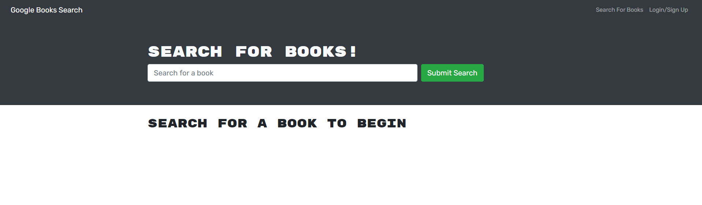
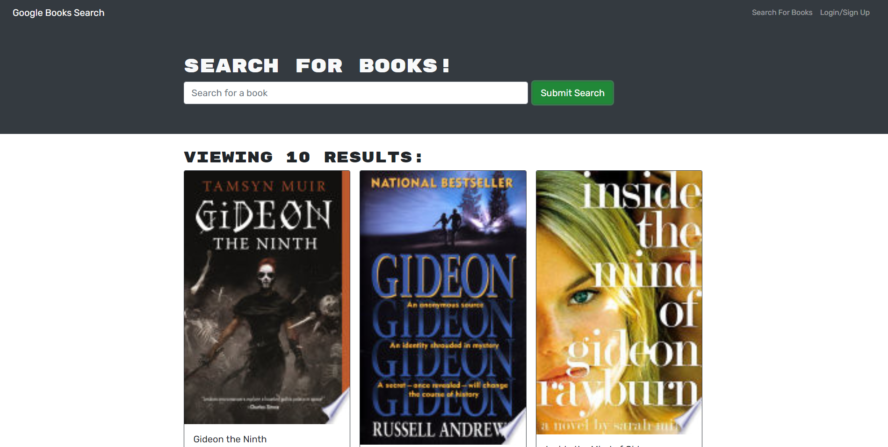
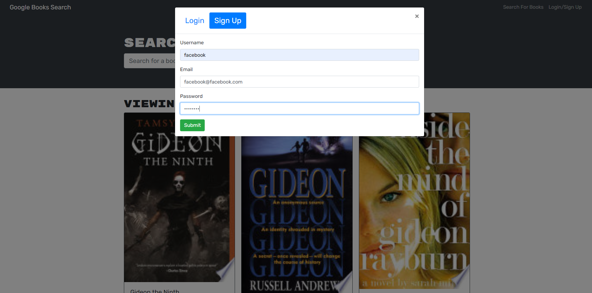
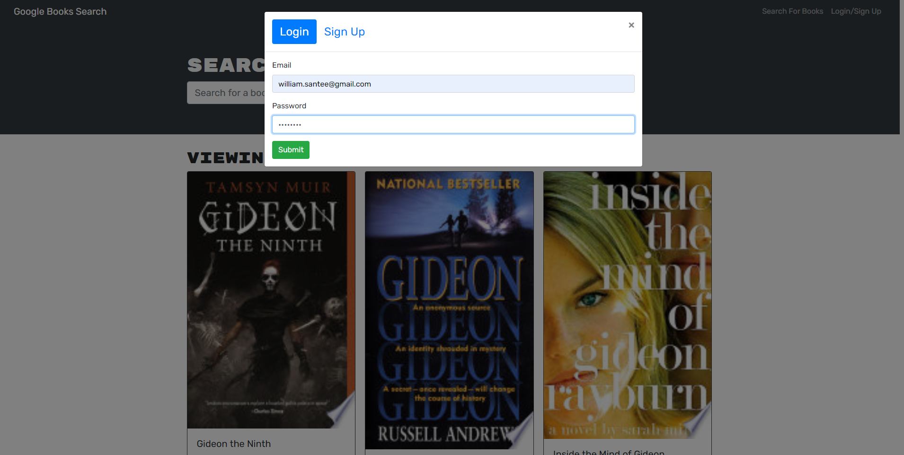
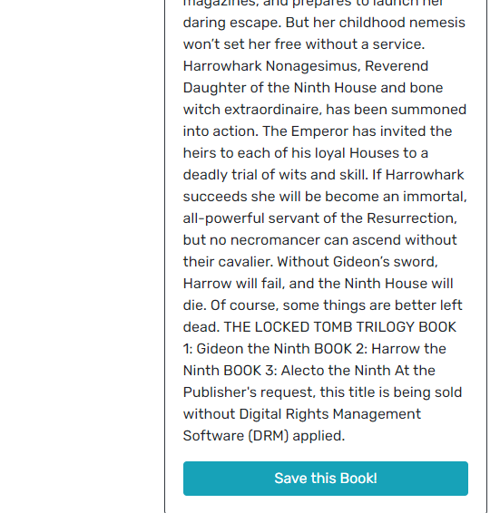
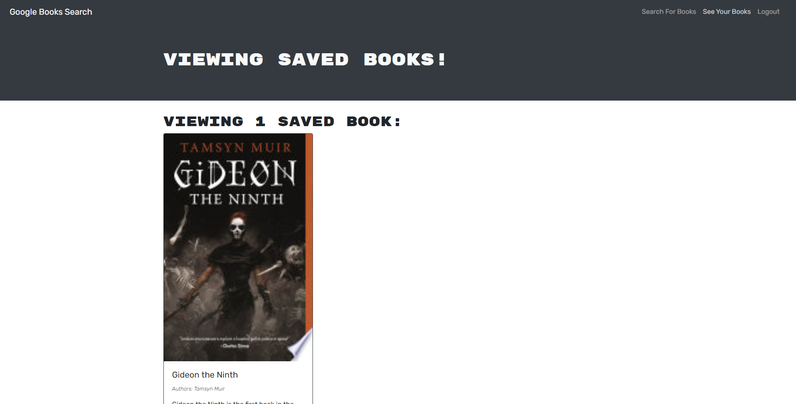
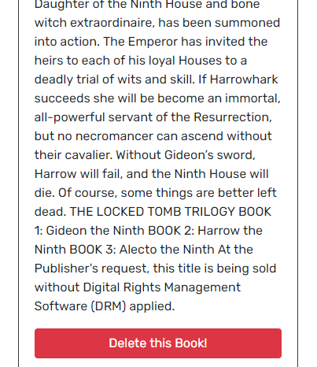

# Book Search Engine

## Description

A MERN stack application that allows users to login, search for books, save them for future reference, and remove them from their list.

## Table of Contents

- [Deployed Application](#Deployed_Application)
- [License](#license)
- [Screenshots](#screenshots)
- [Contributing](#contributing)
- [Questions](#questions)

## Deployed_Application

This application has been deployed at https://desolate-sands-77916.herokuapp.com/ with Heroku

## License

This project is covered under a MIT License. Feel free to use it as you wish.

## Screenshots

## Questions

GitHub User Name: willsan0723

[GitHub Repository](https://github.com/willsan0723/)

If you have any additional questions you can reach me at william.santee@gmail.com
